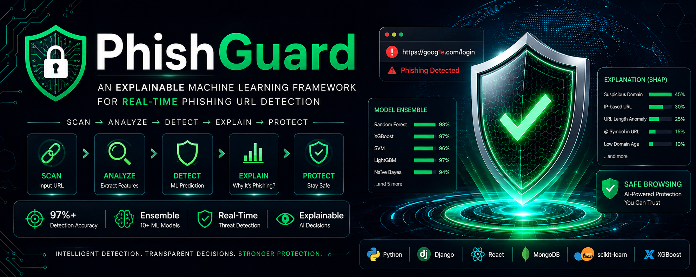

<div align="center">

# 🛡️ PhishGuard 🛡️

### An Explainable Machine Learning Framework for Real-Time Phishing URL Detection

[](https://www.python.org/)
[](https://www.djangoproject.com/)
[](https://reactjs.org/)
[](https://www.mongodb.com/)
[](https://scikit-learn.org/)
[](https://xgboost.readthedocs.io/)



**Scan → Analyze → Detect → Explain → Protect**

[Quick Start](#-quick-start) • [What is Phishing?](#-what-is-phishing) • [How It Works](#-how-it-works) • [Roadmap](#-project-roadmap) • [Architecture](#-system-architecture)

</div>

---

## 🎯 Mission

**PhishGuard** is an intelligent cybersecurity solution that detects malicious URLs in **real-time** using advanced Machine Learning. We combine **feature engineering** and **ensemble learning** to identify phishing attacks with **explainable predictions** — so you know _exactly why_ a URL is dangerous.

```
Traditional Security → Rules-based detection (limited)
PhishGuard           → AI-powered intelligent detection ✨
                      + Explains every decision
                      + Learns from patterns
                      + Real-time protection
```

**Protection Layer You Can Trust.** 🔒

---

## 🚨 What is Phishing?

**Phishing** is when attackers create fake websites that look legitimate to steal your data.

### Real-World Examples

| Attacker Creates                   | You Think | Actually Goes To | Result                |
| ---------------------------------- | --------- | ---------------- | --------------------- |
| `https://goog1e.com/login`         | Google    | Fake site        | 💀 Password stolen    |
| `https://paypa1.com/verify`        | PayPal    | Phishing site    | 💀 Credit card stolen |
| `https://amazon-secure.ru/account` | Amazon    | Russian phishing | 💀 Account hacked     |

### The Problem

- **20% of people** click phishing links
- **3% of those** get infected
- **$5.9 billion/year** in losses globally
- Email filters miss **30%** of phishing attempts

### The Solution

**PhishGuard** catches what humans and simple filters miss. ✨

---

## 💡 How PhishGuard Works

### The Three-Step Process

```
Step 1: EXTRACT           Step 2: PREDICT           Step 3: EXPLAIN
────────────────        ──────────────────        ──────────────────
Input URL                Multiple ML Models        Why is it phishing?
    ↓                          ↓                         ↓
Extract 30-50          Random Forest             Feature importance:
URL features:          + XGBoost                 • Suspicious domain (45%)
• Length               + SVM                     • IP-based URL (30%)
• Special chars        + LightGBM                • URL length anomaly (25%)
• Domain age           + 5 more...
• SSL cert             = Ensemble (97%+ acc)
• ... and 25+ more
```

### Feature Categories Extracted

| Category          | Features           | Examples                                         |
| ----------------- | ------------------ | ------------------------------------------------ |
| **URL Structure** | 9 features         | Length, special chars, dot count, @ symbol       |
| **Domain-based**  | 4 features         | Domain length, TLD, subdomain count, IP presence |
| **Content-based** | 4 features         | Page title, links count, form presence, redirect |
| **Advanced**      | 13+ features       | SSL certificate, domain age, WHOIS data, entropy |
| **Total**         | **30-50 features** | Rich dataset for ML                              |

---

## 🏗️ System Architecture

### High-Level Overview

```
┌─────────────────────────────────────────────────────┐
│              PhishGuard Architecture                │
└─────────────────────────────────────────────────────┘
                      │
        ┌─────────────┴─────────────┐
        ▼                           ▼
   Frontend (React)          Backend (Django)
   ├─ URL Input UI           ├─ REST API (8 endpoints)
   ├─ Real-time checking     ├─ Feature Extractor
   ├─ Results display        ├─ ML Pipeline
   └─ Prediction history     ├─ SHAP Explainer
                             └─ Model Manager
                                    │
                    ┌───────────────┼───────────────┐
                    ▼               ▼               ▼
             MongoDB Database  ML Models       Explanations
             ├─ URLs checked   ├─ RF (trees)  ├─ SHAP values
             ├─ Predictions    ├─ XGBoost     ├─ Feature contrib.
             └─ Features       ├─ SVM         └─ Confidence
                               ├─ LightGBM
                               └─ 5 more...
```

### Prediction Pipeline

```
User URL Input
    ↓
┌─────────────────────────────────┐
│   1. Feature Extraction (10ms)  │  Extract 30-50 URL characteristics
└─────────────────────────────────┘
    ↓
┌─────────────────────────────────┐
│   2. Data Preprocessing (5ms)   │  Normalize, scale, handle missing
└─────────────────────────────────┘
    ↓
┌─────────────────────────────────┐
│   3. Ensemble Prediction (90ms) │  Run through multiple models
│                                 │  • Random Forest
│   ┌─ Model 1: RF → 0.92         │  • XGBoost
│   ├─ Model 2: XGB → 0.95        │  • SVM
│   ├─ Model 3: SVM → 0.88        │  • LightGBM
│   ├─ Model 4: LGB → 0.94        │  • + 5 more
│   └─ ...Voting Classifier       │
│       Final → 0.93              │
└─────────────────────────────────┘
    ↓
┌─────────────────────────────────┐
│   4. Explainability (20ms)      │  Why did we predict phishing?
│                                 │  • Feature importance (SHAP)
│   Top Contributing Features:    │  • Contribution breakdown
│   1. Suspicious domain (45%)    │  • Decision reasoning
│   2. IP-based URL (30%)         │
│   3. URL length (25%)           │
└─────────────────────────────────┘
    ↓
┌─────────────────────────────────┐
│   5. Return Result (5ms)        │  Send to user
│                                 │  • Prediction: Phishing/Legitimate
│   PHISHING ⚠️                   │  • Confidence: 93%
│   Confidence: 93%               │  • Why: Feature breakdown
│   Category: Credential harvester│  • Save to database
└─────────────────────────────────┘

Total Time: ~130ms (Real-time!) ⚡
```

---

## 📊 Current Status

| Component               | Status         | Details                           |
| ----------------------- | -------------- | --------------------------------- |
| **Backend API**         | 🔄 In Progress | Django REST framework setup       |
| **Feature Engineering** | 📋 Planned     | URL feature extraction module     |
| **ML Models**           | 📋 Planned     | Ensemble learning implementation  |
| **Frontend UI**         | 📋 Planned     | React + real-time checking        |
| **Database**            | 📋 Planned     | MongoDB for predictions history   |
| **Explainability**      | 📋 Planned     | SHAP integration for explanations |
| **Testing**             | 📋 Planned     | Model evaluation & API tests      |
| **Documentation**       | 📋 Planned     | API docs + guides                 |

<<<<<<< HEAD
**Current Progress: ML training pipeline implemented** — dataset download, cleaning, feature engineering, stratified train/validation/test split, ensemble training, evaluation, and model persistence are implemented. 🚀

---

## 🧠 Implemented ML Training Pipeline

The current implementation is a real, reproducible training pipeline rather than a hard-coded prediction demo. The public 21,000-row mirror/subset of the referenced Tarun Tiwari dataset is downloaded automatically from Hugging Face. The source page identifies the original Kaggle dataset and uses `0 = legitimate` and `1 = phishing`.

```text
Public dataset
    ↓
Data cleaning
    ↓
Duplicate + conflicting-label removal
    ↓
20 URL-structure features
    ↓
70% train / 15% validation / 15% test
    ↓
Random Forest + Logistic Regression
    ↓
Soft Voting Ensemble
    ↓
Accuracy / Precision / Recall / F1 / ROC-AUC
    ↓
ensemble.joblib
    ↓
Django prediction API
```

### Training command

```bash
cd backend
pip install -r requirements.txt
python scripts/train_model.py
```

The full teacher/demo guide is in [`docs/TRAINING_GUIDE.md`](./docs/TRAINING_GUIDE.md).
=======
**Current Progress: `[░░░░░░░░░░░░░░░░░░░░]` 5%** — Just getting started! 🚀
>>>>>>> upstream/main

---

## 🗺️ Project Roadmap

### Phase 1: Foundation & Data (Week 1-2)

**Goal:** Setup project structure and collect training data

- [ ] GitHub repository with proper structure
- [ ] Django backend scaffold
- [ ] MongoDB integration
<<<<<<< HEAD
- [x] Configure public 21,000-row mirror/subset of the Tarun Tiwari Phishing Site URLs dataset
- [x] Automatic dataset download without Kaggle authentication
- [x] Data cleaning and duplicate/conflict handling
- [x] Save cleaned dataset for inspection
=======
- [ ] Download phishing URL datasets
  - PhishTank (phishing URLs)
  - UNB dataset (legitimate URLs)
  - Target: 10,000-11,000 URLs (balanced)
- [ ] Data exploration notebook
>>>>>>> upstream/main

**Deliverable:** Structured project + cleaned dataset

---

### Phase 2: Feature Engineering (Week 2-3)

**Goal:** Extract meaningful features from URLs

<<<<<<< HEAD
- [x] Build URL feature extractor
- [x] Extract 20 URL-structure features:
=======
- [ ] Build `URLFeatureExtractor` class
- [ ] Extract 30-50 features:
>>>>>>> upstream/main
  - 9 address bar features
  - 4 domain-based features
  - 4 HTML/content features
  - 13+ advanced features
- [ ] Feature correlation analysis
- [ ] Remove redundant features
- [ ] Normalize/scale features
- [ ] Create feature visualization notebook

**Deliverable:** Feature extraction pipeline + processed dataset

---

### Phase 3: ML Model Training (Week 3-4)

**Goal:** Train ensemble learning models

**Base Classifiers (train individually):**

<<<<<<< HEAD
- [x] Random Forest
- [x] Logistic Regression

**Ensemble Approach:**

- [x] Soft-voting ensemble (Random Forest + Logistic Regression)
- [x] Reproducible model configuration

**Model Evaluation:**

- [x] Accuracy, Precision, Recall, F1-Score
- [x] ROC-AUC
- [x] Confusion matrix
- [x] Validation and held-out test evaluation
=======
- [ ] Random Forest
- [ ] XGBoost
- [ ] Gradient Boosting
- [ ] LightGBM
- [ ] CatBoost
- [ ] Support Vector Machine (SVM)
- [ ] Logistic Regression
- [ ] Decision Tree

**Ensemble Approach:**

- [ ] Stacking ensemble (meta-learner: Logistic Regression)
- [ ] Voting classifier (hard voting)
- [ ] Hyperparameter tuning (GridSearchCV)

**Model Evaluation:**

- [ ] Accuracy, Precision, Recall, F1-Score
- [ ] ROC-AUC curves
- [ ] Confusion matrix
- [ ] Cross-validation (k-fold)
>>>>>>> upstream/main

**Target Accuracy:** >95%

**Deliverable:** Trained ensemble model + evaluation report

---

### Phase 4: Explainability (Week 4-5)

**Goal:** Make predictions interpretable

- [ ] Integrate SHAP library
- [ ] Feature importance visualization
- [ ] Individual prediction explanations
- [ ] Decision reasoning for each URL
- [ ] Contribution breakdown chart
- [ ] Create explainability service module

**Deliverable:** SHAP explainer + visualization UI

---

### Phase 5: Backend API (Week 5-6)

**Goal:** Build REST API for predictions

**Endpoints:**

- [ ] `POST /api/check-url/` — Check single URL
- [ ] `POST /api/batch-check/` — Check multiple URLs
- [ ] `GET /api/predictions/` — Get prediction history
- [ ] `GET /api/predictions/{id}/` — Get specific prediction
- [ ] `GET /api/categories/` — Get phishing categories
- [ ] `GET /api/health/` — Health check
- [ ] `GET /api/docs/` — API documentation
- [ ] `GET /api/stats/` — System statistics

**Features:**

- [ ] Input validation
- [ ] File upload handling
- [ ] Real-time prediction (< 200ms)
- [ ] Database persistence
- [ ] Error handling
- [ ] API rate limiting
- [ ] Swagger UI documentation

**Deliverable:** Production-ready REST API

---

### Phase 6: Frontend UI (Week 6-7)

**Goal:** Beautiful user interface

**Pages:**

- [ ] Home/Landing page
  - What is phishing?
  - How PhishGuard works
  - Key features showcase
- [ ] Check URL page
  - URL input field
  - Real-time checking indicator
  - Results display
  - Explanation visualization
- [ ] Batch Check page
  - Multiple URL upload
  - CSV import
  - Results download
- [ ] History page
  - Previous predictions
  - Filters & search
  - Statistics
- [ ] Dashboard page
  - Stats & analytics
  - Most common phishing patterns
  - Protection statistics

**Features:**

- [ ] Real-time input validation
- [ ] Beautiful UI with Tailwind CSS
- [ ] Animations with Framer Motion
- [ ] Responsive design (mobile-friendly)
- [ ] Dark mode support
- [ ] Local storage for history
- [ ] Share results functionality

**Deliverable:** Full-featured React frontend

---

### Phase 7: Integration & Testing (Week 7-8)

**Goal:** End-to-end system integration

- [ ] Frontend ↔ Backend API integration
- [ ] Database connectivity verification
- [ ] Model loading & inference testing
- [ ] CORS configuration
- [ ] End-to-end workflow testing
- [ ] Performance testing
- [ ] Security testing
- [ ] Load testing

**Deliverable:** Fully integrated, tested system

---

### Phase 8: Documentation & Polish (Week 8)

**Goal:** Complete documentation and deployment

- [ ] API documentation (Swagger)
- [ ] User guide
- [ ] Installation guide (Windows/Mac/Linux)
- [ ] Architecture documentation
- [ ] Feature engineering explanation
- [ ] Model training guide
- [ ] Troubleshooting guide
- [ ] Code comments & docstrings
- [ ] Deploy to GitHub Pages
- [ ] Create demo video

**Deliverable:** Complete documentation + production-ready code

---

## 📈 Progress Tracker

```
Phase 1: Foundation & Data       [░░░░░░░░░░░░░░░░░░░░]   0% 📋
Phase 2: Feature Engineering     [░░░░░░░░░░░░░░░░░░░░]   0% 📋
Phase 3: ML Model Training       [░░░░░░░░░░░░░░░░░░░░]   0% 📋
Phase 4: Explainability          [░░░░░░░░░░░░░░░░░░░░]   0% 📋
Phase 5: Backend API             [░░░░░░░░░░░░░░░░░░░░]   0% 📋
Phase 6: Frontend UI             [░░░░░░░░░░░░░░░░░░░░]   0% 📋
Phase 7: Integration & Testing   [░░░░░░░░░░░░░░░░░░░░]   0% 📋
Phase 8: Documentation & Polish  [░░░░░░░░░░░░░░░░░░░░]   0% 📋

Overall Progress: [░░░░░░░░░░░░░░░░░░░░] 0% — Let's build! 🚀
```

---

## 🚀 Quick Start

### Prerequisites

- Python 3.9+
- Node.js 18+
- MongoDB 8.0+
- Git
- 4GB RAM minimum

### Installation

```bash
# 1. Clone repository
git clone https://github.com/YourUsername/PhishGuard.git
cd PhishGuard

# 2. Setup Backend
cd backend
python -m venv .venv

# Activate virtual environment
# On Linux/Mac:
source .venv/bin/activate
# On Windows:
.venv\Scripts\activate

# Install dependencies
pip install -r requirements.txt

# 3. Setup Frontend
cd ../frontend
npm install

# 4. Start MongoDB
mongod
# Or if using Docker:
docker run -d -p 27017:27017 --name mongodb mongo

# 5. Run Backend
cd ../backend
source .venv/bin/activate
python manage.py runserver
# Backend at http://localhost:8000

# 6. Run Frontend (new terminal)
cd frontend
npm run dev
# Frontend at http://localhost:5173
```

---

## 🛡️ Tech Stack

| Category               | Technologies                                      |
| ---------------------- | ------------------------------------------------- |
| **Backend**            | Python 3.9, Django 4.2, Django REST Framework     |
| **Frontend**           | React 18, TypeScript, Tailwind CSS, Framer Motion |
| **ML/AI**              | scikit-learn, XGBoost, CatBoost, LightGBM, SHAP   |
| **Database**           | MongoDB 8.0, MongoEngine ORM                      |
| **Feature Extraction** | pandas, NumPy, urllib3                            |
| **Documentation**      | Swagger/drf-yasg, ReDoc                           |
| **Deployment**         | Docker (optional), GitHub Pages, Railway/Vercel   |

---

## 📁 Project Structure

```
PhishGuard/
├── backend/                          # Django REST API
│   ├── .venv/                       # Virtual environment
│   ├── phishguard/
│   │   ├── settings.py              # Django settings
│   │   ├── urls.py                  # URL routing
│   │   └── wsgi.py
│   ├── api/
│   │   ├── views.py                 # API endpoints
│   │   ├── serializers.py           # Data serializers
│   │   └── urls.py
│   ├── ml/
│   │   ├── feature_extractor.py     # URL feature extraction
│   │   ├── model_manager.py         # Model loading & prediction
│   │   ├── explainer.py             # SHAP explainability
│   │   └── models/                  # Trained models
│   │       ├── ensemble_model.pkl
│   │       └── feature_names.json
│   ├── data/
│   │   ├── raw/                     # Raw datasets
│   │   └── processed/               # Cleaned data
│   ├── notebooks/
│   │   ├── 01_data_exploration.ipynb
│   │   ├── 02_feature_engineering.ipynb
│   │   └── 03_model_training.ipynb
│   ├── requirements.txt
│   └── manage.py
│
├── frontend/                         # React Application
│   ├── src/
│   │   ├── pages/
│   │   │   ├── Home.tsx
│   │   │   ├── CheckURL.tsx
│   │   │   ├── Results.tsx
│   │   │   ├── History.tsx
│   │   │   └── Dashboard.tsx
│   │   ├── components/
│   │   │   ├── URLInput.tsx
│   │   │   ├── ResultCard.tsx
│   │   │   ├── ExplanationChart.tsx
│   │   │   └── Navigation.tsx
│   │   ├── hooks/
│   │   │   └── usePhishCheck.ts
│   │   └── App.tsx
│   ├── package.json
│   └── vite.config.ts
│
├── README.md                        # This file!
├── QUICKSTART.md                    # Quick setup guide
├── ARCHITECTURE.md                  # System design details
└── .gitignore
```

---

## 🧠 Key Concepts

### Feature Engineering

We extract **30-50 features** from URLs to detect patterns that indicate phishing:

```python
# Example: Check for suspicious @ symbol
url = "https://google.com@malicious.ru"
#               ↑ Attacker hides true domain here!
features['has_at_symbol'] = 1  # RED FLAG! 🚩
```

### Ensemble Learning

Instead of trusting one model, we combine multiple models:

```
Random Forest prediction   →  0.92 (Phishing)
XGBoost prediction       →  0.95 (Phishing)
SVM prediction           →  0.88 (Phishing)
LightGBM prediction      →  0.94 (Phishing)
Voting Ensemble          →  0.93 (FINAL)

Why? Because "Wisdom of the crowd" works! 🧠
```

### Explainability (SHAP)

We don't just say "it's phishing" — we explain why:

```
Prediction: PHISHING ⚠️
Confidence: 93%

Why?
1. Suspicious domain name    (contributes 45%)
2. URL uses IP address       (contributes 30%)
3. Unusual URL length        (contributes 25%)

Trust the system because you understand it! ✨
```

---

## 🎓 Learning Outcomes

By completing this project, your team will learn:

**Machine Learning:**

- [ ] Feature engineering & extraction
- [ ] Ensemble learning methods
- [ ] Model evaluation & hyperparameter tuning
- [ ] Classification problems & evaluation metrics
- [ ] Model explainability techniques

**Web Development:**

- [ ] Full-stack application architecture
- [ ] Django REST API design
- [ ] Real-time frontend updates
- [ ] Database integration
- [ ] API documentation

**Cybersecurity:**

- [ ] Phishing attack mechanisms
- [ ] URL anatomy & suspicious patterns
- [ ] Security best practices
- [ ] Data protection strategies

**Professional Skills:**

- [ ] Project management (8-week timeline)
- [ ] Team collaboration (4 people)
- [ ] Git & version control
- [ ] Technical documentation
- [ ] Presentation skills

---

## 🤝 Team Roles

Suggested role distribution for 4-person team:

| Role              | Responsibilities                                    |
| ----------------- | --------------------------------------------------- |
| **ML Lead**       | Feature engineering, model training, explainability |
| **Backend Lead**  | Django API, database, model integration             |
| **Frontend Lead** | React UI, visualization, user experience            |
| **DevOps/QA**     | Testing, documentation, deployment                  |

_Note: Everyone should understand the full system!_

---

## 📚 Resources & References

### Datasets

- **PhishTank**: https://www.phishtank.com/
- **UNB URL Dataset**: https://www.unb.ca/cic/datasets/url-2016.html
- **Kaggle Phishing URLs**: https://www.kaggle.com/

### Papers & Articles

- Feature extraction for phishing detection
- Ensemble learning for cybersecurity
- SHAP: SHapley Additive exPlanations

### Libraries Documentation

- scikit-learn: https://scikit-learn.org/
- XGBoost: https://xgboost.readthedocs.io/
- SHAP: https://shap.readthedocs.io/
- Django REST: https://www.django-rest-framework.org/

---

## 🎯 Success Metrics

| Metric             | Target                          |
| ------------------ | ------------------------------- |
| **Model Accuracy** | >95%                            |
| **Precision**      | >94% (minimize false positives) |
| **Recall**         | >96% (catch most attacks)       |
| **F1-Score**       | >95%                            |
| **Inference Time** | <200ms per URL                  |
| **API Uptime**     | 99.5%                           |
| **Code Coverage**  | >85%                            |
| **Documentation**  | 100% complete                   |

---

## 🚀 Getting Help

**Stuck?** Here's where to look:

1. **QUICKSTART.md** — Quick setup guide
2. **ARCHITECTURE.md** — Deep dive into system design
3. **backend/notebooks/** — Jupyter notebooks with examples
4. **API Documentation** — http://localhost:8000/api/docs/
5. **GitHub Issues** — Ask questions & report bugs
6. **Team Discussion** — Slack/Discord for real-time help

---

## 📝 Next Steps

1. ✅ **Read this README** (you are here!)
2. 📋 **Review QUICKSTART.md** — Get the project running
3. 🏗️ **Read ARCHITECTURE.md** — Understand the system
4. 💻 **Start Phase 1** — Create GitHub repo & setup backend
5. 🤝 **Assign team roles** — Divide responsibilities
6. 📊 **Download datasets** — Get phishing URLs ready

**Timeline:** 8 weeks from start to production! ⏰

---

## 📊 Final Statistics

| Aspect              | Details                   |
| ------------------- | ------------------------- |
| **Team Size**       | 4 people                  |
| **Duration**        | 8 weeks                   |
| **Project Type**    | Full-stack ML application |
| **Difficulty**      | Advanced (ML + Web)       |
| **Learning Value**  | 🌟🌟🌟🌟🌟 (5/5)          |
| **Portfolio Worth** | 🔥🔥🔥🔥🔥 (5/5)          |

---

<div align="center">

## 🎊 Ready to Build?

### 🛡️ PhishGuard: Protecting the Internet, One URL at a Time 🛡️

**Let's catch those phishing attacks and keep the internet safe!**

---

**Next: [→ QUICKSTART.md](./QUICKSTART.md)** for setup instructions

Built with ❤️ by Dibakar

_PhishGuard - Real-Time Phishing Detection with Explainable AI_

</div>

---
